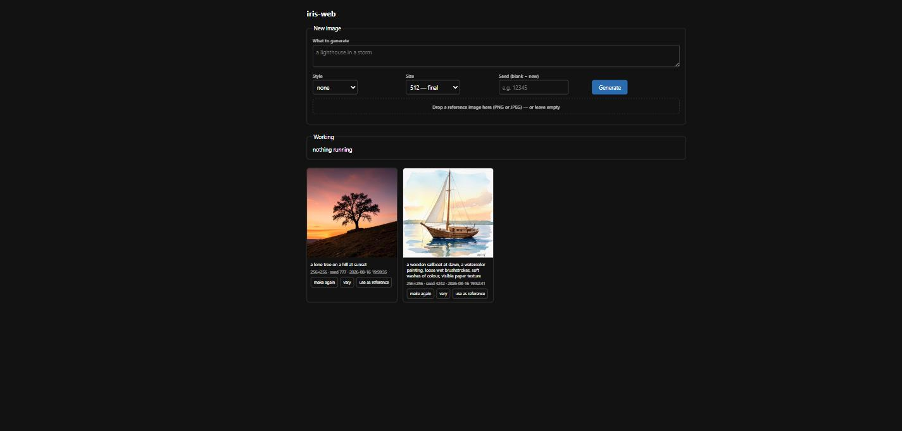

# iris-web

A small local gallery for [iris.c](https://github.com/antirez/iris.c), the pure-C image generation engine by Salvatore Sanfilippo.

Generating an image with iris takes minutes, and the seed that produced it is printed once and then lost when the terminal closes. This puts a browser page in front of it: you queue prompts and walk away, and every finished image keeps its prompt and its seed, so any picture can be made again exactly.



**Python standard library only.** Nothing to install, no packages, no build step. It runs iris as a subprocess and gets out of the way.

## What it does

- **Queue** several generations and leave: they run one after another.
- **Real progress**, read from what iris prints while it works, not a guess.
- **Every image keeps its prompt and seed.** *Make again* reproduces a picture byte for byte; *vary* keeps the prompt and rolls a new seed.
- **Drop a photo in** to redraw it in another style (img2img).
- **Eight ready-made styles**, written as descriptions rather than instructions, which is the form these models handle best.
- Images made from the command-line scripts show up in the same gallery.

## Requirements

1. **iris**, built and working — see [antirez/iris.c](https://github.com/antirez/iris.c).
2. **A model**, downloaded with iris's own `download_model.py` (about 16 GB for `flux-klein-4b`).
3. **Python 3.8 or newer.**

Put the two projects side by side and everything is found automatically:

```
somewhere/
├── iris.c/          the engine, built, with its model folder inside
└── iris-web/        this
```

## Running it

```bash
python iris_web.py
```

It prints the address to open — `http://127.0.0.1:8770` unless that port is taken, in which case it moves to the next free one and says so. On Windows you can double-click `scripts/start-web.bat` instead.

Nothing is reachable from outside your machine: it listens on `127.0.0.1` only, and it should stay that way, since it hands text to a subprocess.

If your layout is different, or the guesses are wrong:

```
--iris PATH      the iris binary
--model PATH     a model folder (one containing model_index.json)
--threads N      BLAS threads; the default is half your logical CPUs
--port N         preferred port
--no-browser     do not open a browser
```

About `--threads`: on a 4-core/8-thread machine, 4 threads measured **19% faster** than 8. The cores already saturate the vector units, so hyperthreading only adds contention with iris's own attention threads. Half the logical CPUs is a reasonable guess at the physical core count, but if your CPU has no hyperthreading you are giving away half the machine — pass the real number.

## Command-line scripts (Windows)

In `scripts/`, useful when you do not want a browser:

- **`generate.bat "a lighthouse in a storm" 512`** — one image.
- **`restyle.bat`** — **drag a photo onto it** and pick a style. Keeps the aspect ratio of your picture.

Both find iris and the model on their own, write to the same catalog as the web interface, and record the seed.

Readable image formats are PNG, JPEG and PPM. **Not** TIFF, BMP, WEBP, HEIC (what iPhones produce by default) or PDF — convert those first. Large photos are scaled down automatically; the limit is 1792 pixels on the long edge.

## Where things go

```
images/
├── catalog.jsonl        one JSON line per image: file, prompt, seed, size, date
├── input/               reference images you dropped in
└── *.png                the results
```

The catalog is plain text, one JSON object per line. Nothing is hidden in a database, and it survives this program entirely.

## Windows note

iris does not build on Windows out of the box. The patches that make it work are in [`patches/`](patches/), with instructions — they are also proposed upstream as [antirez/iris.c#52](https://github.com/antirez/iris.c/pull/52). If that lands, the folder can be deleted and you build the official sources directly.

## Honest limitations

- **Only tested on Windows.** The code has no Windows-specific logic outside a small block, and should run on Linux and macOS unchanged — but I have not run it there, and I would rather say so than let you find out.
- Generating is slow because the model is slow: minutes per image on a CPU. This does not make iris faster, it just makes waiting less annoying.
- Keeping the browser open costs a little speed, since polling competes with the generation for the same cores.
- No way to delete images from the interface. Delete the file and its catalog line by hand.
- One image at a time, on purpose: two in parallel would not finish sooner on a saturated CPU.

## Credits and licence

The engine is [iris.c](https://github.com/antirez/iris.c), copyright Salvatore Sanfilippo, MIT licensed. This project contains none of its code: it only runs the binary. All the interesting work — the transformers, the VAE, the tokenizer, a PNG and a JPEG codec written from scratch — is his.

This interface is MIT licensed too. See [LICENSE](LICENSE).
